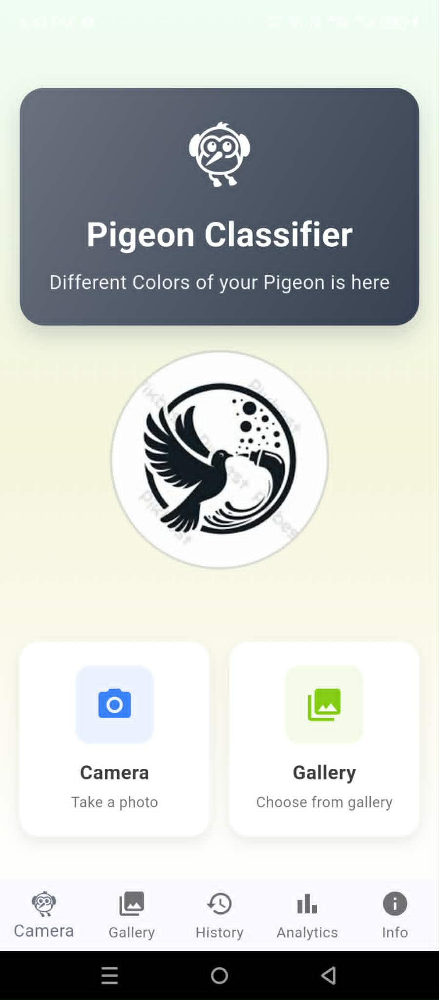
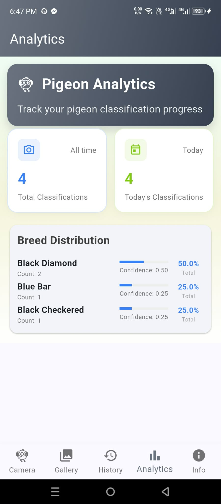
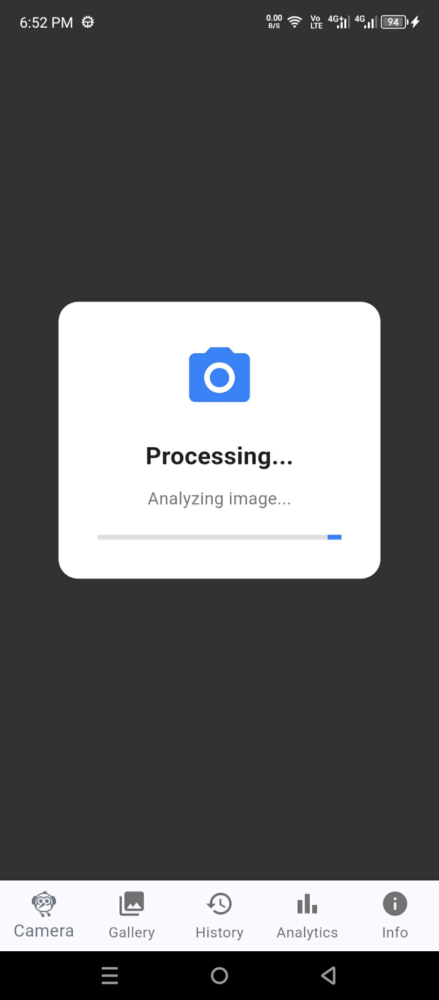
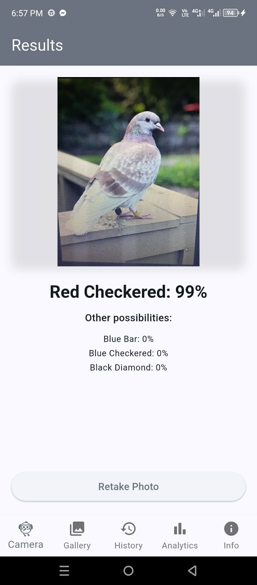
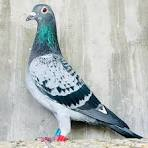
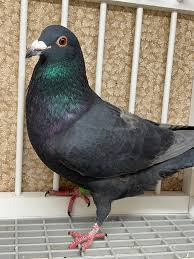
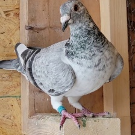

  

  

  

---

## 🎓 About Me

class StudentDeveloper:
    def __init__(self):
        self.name = "Kenneth A. Baldomar"
        self.focus = "Mobile & Web Based"
        self.location = "Cabadbaran City"
        self.technologies = ["HTML","PHP","CSS","Flutter", "Dart", "JAVA", "Python", "TensorFlow Lite"]
    
    def say_hi(self):
        print("Thanks for visiting! Let's build something awesome.")

me = StudentDeveloper()
me.say_hi()

- 🧠 **Interests**: Mobile development, machine learning, ornithology  
- 🐦 **Main project**: Pigeon Variety Classifier (Flutter + TensorFlow Lite)  
- 🌱 **Learning**: Advanced ML models & bird recognition systems  

---

## 🛠️ Tech Stack

**Languages & Frameworks**

**Tools**

---

## 🐦 Pigeon Variety Classifier App

A Flutter mobile app that uses **TensorFlow Lite** to classify different pigeon varieties from camera images.

### 🏠 Main Page & 📊 Analytics

| **Main Page** | **Analytics** |
| ------------- | ------------- |
|  |  |

The **Main Page** lets users classify pigeons via camera, view analytics, or check history.  
The **Analytics** screen shows detection frequency and usage stats for each pigeon variety.

---

### 📷 Camera, 📄 Records & ✅ Result

| **Camera** |**Processing**| **Records** | **Result** |
| ---------- | ------------ | ----------- | ---------- |
|  ||  |  |

- **Camera**: Capture or upload a pigeon image.  
- **Records**: View past classifications with timestamps.  
- **Result**: See predicted pigeon variety and confidence scores.

---

## 🕊️ Pigeon Varieties

Pigeon images are stored in [`Pigeon_Classes`](https://github.com/your-username/your-repo/tree/main/Pigeon_Classes).  
These are the pigeon varieties the model can recognize.

<table>
  <tr>
    <td align="center">
       
      <b>Blue Bar</b> 
      Classic blue-gray with two barsLarge, calm breed often raised for utility.
    </td>
    <td align="center">
       
      <b>Blue Checkered</b> 
      Blue-gray with checkered pattern.
    </td>
    <td align="center">
       
      <b>Black Diamond</b> 
      Dark with diamond markings.
    </td>
    <td align="center">
       
      <b>Black Checkered</b> 
      Black with checkered pattern.
    </td>
    <td align="center">
       
      <b>White Dove</b> 
      Pure white, symbol of peace.
    </td>
  </tr>
  <tr>
    <td align="center">
       
      <b>Grizzle</b> 
      Mixed light and dark feathersKnown for aerial acrobatics and tumbling flight.
    </td>
    <td align="center">
       
      <b>Red Bar</b> 
      Reddish with two bars.
    </td>
    <td align="center">
       
      <b>Red Checkered</b> 
      Reddish with checkered pattern.
    </td>
    <td align="center">
       
      <b>Fancy</b> 
       Ornamental or show pigeon.
    </td>
    <td align="center">
       
      <b>German Beauty</b> 
      Elegant German breed.
    </td>
  </tr>
</table>

---

## 📊 GitHub Stats

<table>
  <tr>
    <td>
      
    </td>
    <td>
      
    </td>
  </tr>
</table>

---

## 🎯 Goals

- Improve pigeon classification accuracy  
- Add more pigeon varieties to the model  
- Build a community for bird recognition apps  
- Contribute to open-source Flutter/ML projects  

---

  <b>“Fly high, code higher.”</b>

